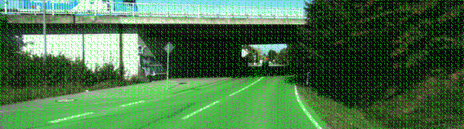
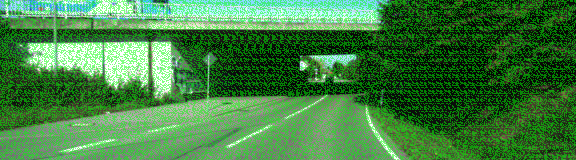
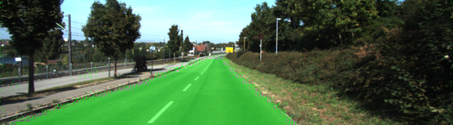
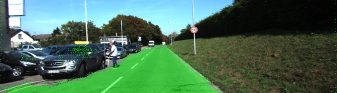
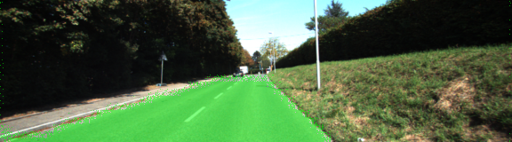
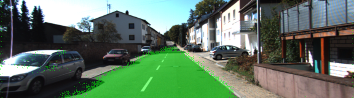

## Semantic Segmentation Project READ ME

In this project, we were looking to establish some scene understanding and perform semantic segmentation using Fully 
Convolutional Networks. One of the papers we looked at was: 
Fully Convolutional Networks for Semantic Segmentation: https://people.eecs.berkeley.edu/~jonlong/long_shelhamer_fcn.pdf

Some of the challenges I ran into were understanding the dimensions of the vgg16 network, understanding how we are skipping and merging layers, and also structuring my code such that I am able to upsample and merge layers properly without running into tensor shape issues.

The other unexpected challenge I ran into was how noisy my data was, which I will explain in detais how only using a regularizer wasn't enough to solve the issue.

### Noise and the problem of green evil squares
During the classroom walkthrough, it was recommended to use kernel_regularizer: https://www.tensorflow.org/api_docs/python/tf/contrib/layers/l2_regularizer

If you are new to the domain like myself, you would wonder about the best values ot be used for such reguarlizer. The walkthrough used 1e-3, however I discovered that wasn't enough by any stretch of imagination. I still had really noisy data with a regularalizer for 1e-3:

So for out of curiosity, I ran my network to see what would happen if I removed the regularizer, to see if my regularizer is actually doing something. And yes indeed, it is definitely improving the quality of our training. Here is how my images looked like for a run without any regularization:

Then after that I realized that I have two problems:
1- I don't have the correct regularization value
2- I need to initalize my weights with some randomly seeded value, reading online there were some benefits to initializing your tensors and graph
3- Thanks to other students, I expiremented with kernel initalization and was able to get really good results (Credit goes to Jeremy Shanon for that discovery)

### Training

I started initially with 50 epochs , then settled somewhere between 7 to 10 epochs. After the 13th epoch the loss values start to not make sense at all. I found 7 to be a happy sweet spot.

Here are some example images after training:

### Seeding and randomization
One of the things I learnt from discussions on the forums and reading online is how to deal with some noise generated.
I found some students and other tensorflow users online recommending intializing with normally distributed randomized values.

I found that to be really interested, since you are loading your tensorflow graph with certain values and learning from there.
I have also seen cases of students where skewed initializations have caused some pain and agony during debuging their models.

Here are some of the references I found valuable
https://www.tensorflow.org/api_docs/python/tf/set_random_seed
https://discussions.udacity.com/t/can-learning-go-wrong-on-a-run-due-to-randomness/402421/2

### Conclousion
There are a lot of methods to normalize, skew and deal with noise. I found that be where most of the deep learning work really is. Getting the first 80% to 90% is really 40% of the work. Getting to a tweaked confident model is where most of the tricky work is.

### References and awesome students that helped

Jeremy Shanon: https://medium.com/@jeremyeshannon/udacity-self-driving-car-nanodegree-project-12-semantic-segmentation-133281f56f28

John Chen and and Nikolay Falaleev for teaching me how to better structure my code
